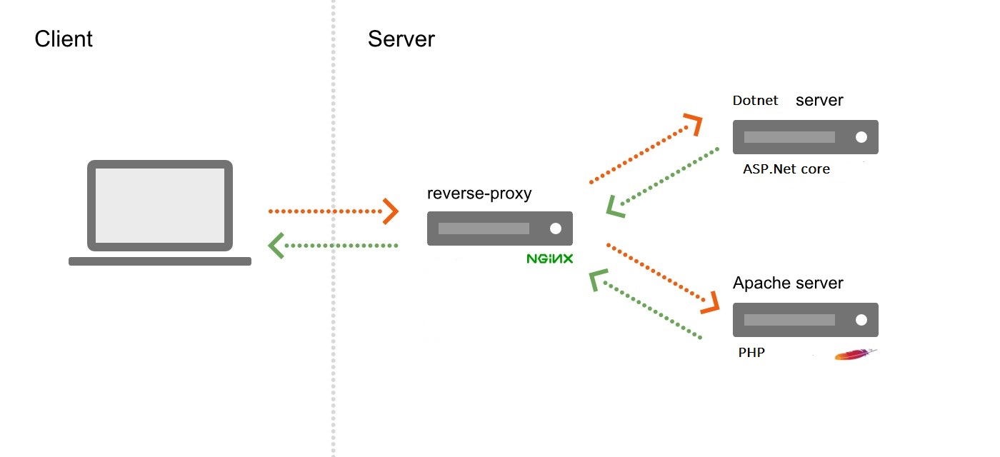

# Nginx reverse proxy / PHP app / ASP.Net core app



## Description

Here the way to use Nginx as a reverse proxy with an PHP application and an ASP.Net core application. 

### Prerequisites

- Git SCM 
- Docker (compose)

### Installing

1. Clone the repo
2. Go to /docker 
3. Run the following command

```
docker-compose build
docker-compose up
```

Enjoy !

### Running app 

- Nginx -> http://localhost:80
- PHP app -> http://localhost/php
- ASP.Net Core app -> http://localhost/aspnet